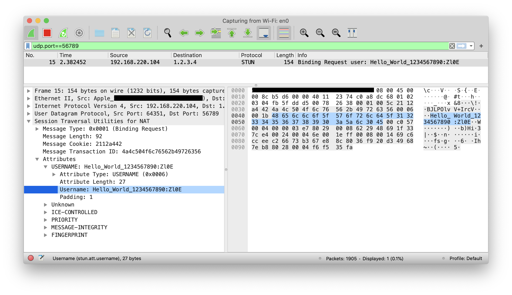

# 传统的端口敲门

[端口敲门](https://en.wikipedia.org/wiki/Port_knocking) 是一种特殊的安全认证方案。它没有固定的标准，每个人的实现各不相同。当然，即使没听说过这个名词，不少人也有类似的想法和实现。

例如我曾经使用 Windows 服务器时，一直对远程桌面颇为不满。不是因为这个服务做得不好，相反，是做得太好了，以至于一个不知道账号密码的陌生人试着访问时，都会为它绘制窗口、传输画面，服务太过周到了！攻击者即使猜不到密码，也能白白消耗服务器资源和网络流量。况且，越复杂的程序出现漏洞的可能性越大，万一哪天出现缓冲区溢出之类的漏洞，攻击者不用知道密码也能控制服务器。这太不完美了！

在我看来，认证应该越早越好。对于不知道认证规则的陌生人，甚至 TCP 连接都不值得为它建立！这即利于 **系统安全**（减少密码爆破、漏洞攻击等风险），又利于 **网络安全**（减少恶意消耗流量、DDoS 攻击等风险）。

于是写了个简单的防火墙小程序，默认拦截所有 IP。只有当某个 IP 访问了「秘密端口」后，才将其加入白名单，允许进一步通信。这就是一个典型的端口敲门方案，那个访问秘密端口的数据包，便是敲门砖。

----

当然，仅凭一个端口作为暗号还是有些简陋，很容易被破解，因此需加强。例如使用多个端口、使用特定数据的 UDP 包等等。甚至还可以在数据包中加入更复杂的认证信息，当然这需要通过专门的程序敲门了，而不能简单地使用系统命令手动敲门。

事实上用程序敲门是很常见的方案。例如一些公司要求员工安装某个程序才能访问内网，该程序很可能给网关发送了敲门数据包。

那么，敲门程序是否适用于公网？更进一步，是否能做成 Web 版？


# 公网 Web 敲门

敲门程序放在公网似乎不太好，毕竟这是一种基于保密的安全方案，细节公开后效果就大打折扣了，除非对程序做很强的混淆保护。

前面提到，敲门有两个意义：保护系统安全、保护网络安全。现在聊聊后者。

接着从之前做防火墙聊起。虽然那只是个玩具级的小程序，但实际效果还不错，并且性能极高（驱动层过滤包）。分享给一些好友试用后，很快就有人思考如何应用到现实中 —— 那些经常被攻击的游戏服务器。

但这并不好实现。总不能要求玩家复制粘贴一堆 cmd 命令手动敲门吧。让玩家下载敲门程序？这相当于是在推广软件，成本不小。除非把敲门程序和登录器捆绑在一起，但这款游戏被魔改的五花八门，登录器各不相同，实现起来很麻烦。

一番摸索后发现，几乎所有的登录器都内嵌网页，显示公告信息之类的。如果实现一个 JS 版的敲门程序，那么直接让管理员插到公告页里就可以，连登录器都不用升级！


## TCP/SYN 直接敲门

### v1 单端口

第一个实验版本非常简单，甚至都没用上 JS，仅仅敲服务器一个固定端口。

```html

```

为了隐蔽，URL 里没有暴露服务器 IP，而是用一个指向该 IP 的域名替代，并加上迷惑性路径。

> 事实上服务器会丢弃 SYN 敲门包，所以连接都无法建立，URL 路径是毫无用途的

试用后效果很好。伪造游戏协议的捣乱机器人 TCP 都建立不了，更别说登录了；即使用 SYN Flood 攻击游戏端口，服务器也是一个 ACK 都不回复，极大节省了系统资源和流量开销（出站流量很贵）。通过这个简单粗暴的敲门方案，L7 和 L4 攻击都能轻松防住。当然，除非特别大的流量直接把服务器 IP 打进黑洞，那倒是无解，不过软件形式的防火墙对此都无能为力。

尽管敲门机关是公开的，但大部分人都不会想到藏在网页里~

当然，被发现也是早晚的事。在被破解之前，这个方案改良了多次。

### v2 多端口

敲门端口只有一个，感觉太简陋。但即使有多个，攻击者只要扫描下所有端口，总能敲到这几个。

因此，多端口敲门必须要按顺序，否则意义就不大了。

不过实现后发现有个问题，服务器收到的 SYN 包顺序，未必就是客户端发送时的顺序。因此只能通过延迟发送的方式，尽量保证顺序。

```js
function load(url) {
  new Image().src = url
}

load('http://xxx.xxx:50000')

setTimeout(function() {
  load('http://xxx.xxx:10000')
}, 100)

setTimeout(function() {
  load('http://xxx.xxx:30000')
}, 200)
```

当然，这么做的后果就是增加了敲门时间。

> 这里用 `onerror` 事件是没有意义的。因为服务器会丢弃 SYN 包，所以客户端需要重发多次 SYN 才会产生 TCP 连接超时错误，可能要几秒甚至几十秒之后才会触发该事件。


### v3 动态多端口

多端口实现了，但是端口号仍是固定的，感觉仍不完美。于是接着改进。

如果端口号是动态的，那么前后端如何保持一致？最容易想到的，就是通过时间生成端口号。

```js
var port = gen_port(time())
load('http://xxx.xxx:' + port)
```

但这也存在一个问题，并非所有用户的时间都是准的。如果误差超出允许范围，那么敲门就会失效。

因此，敲门之前需校准时间。我们提供一个返回时间的接口，或者直接用网上免费公开的接口。为了确保稳定性，JS 里准备多个接口，只要有一个可用就不会失效。

当然，动态端口也有一些问题。例如配有硬件防火墙的服务器可能没法使用，除非服务器能和防火墙设备保持互动。（如今云服务器的云防火墙确实可通过 API 实时修改规则~）


## UDP/DNS 直接敲门

事实上，前面几个改良的意义都不大，都是建立在攻击者还没发现的基础上。然而秘密总是会暴露的。

如何继续改进？思考了下问题所在：只发几个 SYN 包就能通过防火墙验证的话，攻击者太容易模拟，伪造成本太低。但如果敲门包里能容纳更多信息，那就可以带上 JS 生成的认证数据，这样伪造起来麻烦多了。

但 TCP 显然不行，毕竟端口号才 16bit，可携带的信息太少了，需要发送几十上百个请求才能勉强传递认证数据，效率太低。因此只能用 UDP。

在 Web 中和 UDP 相关的通信，最容易想到的是 DNS。并且可通过 NS 型泛域名，一次携带可观的数据到指定服务器。

```js
var auth = gen_auth()
load('http://' + encode(auth) + '.xxx.xxx.xxx')
```

不过这个方案存在本质性问题：服务器收到的 UDP 包，并不是用户发给它的，而是用户运营商 DNS 发的。所以服务器看到的源 IP 是运营商 DNS IP，而不是用户 IP！既然连用户 IP 都拿不到，那还有什么用。

当时想到一个有趣的解决方案：JS 先通过一些免费公开的接口获取公网 IP，然后将其加密到认证信息里；服务器最终使用认证信息里的 IP，而不是数据包的 IP。这样就能拿到用户 IP 了！

```js
jsonp_public_ip_callback = function(ip) {
  var auth = gen_auth(ip, ...)
  load('http://' + encode(auth) + '.xxx.xxx.xxx')
}

load_js('http://xxx.com/get_public_ip')
```

当然，这个方案严重依赖 JS 代码混淆。一旦加密算法被破解，攻击者可以轻轻松松将任何 IP 刷进防火墙白名单。

> 其实 SYN 敲门方案，攻击者也能伪造源 IP，给任意 IP 加白，但需要特殊的网络环境才能发送。而 UDP/DNS 这种方案任何网络环境都可以


## UDP/DNS 中转敲门

使用 UDP/DNS 敲门还有一个问题：服务器需要开放 UDP:53 端口，但有些网络可能不允许。

这种情况只能通过中转。NS 域名指向我们的服务器，我们分析 UDP 数据后再将用户 IP 推送给游戏服务器（游戏服务器和我们保持长连接）。这样就不用关心网络问题了。


## TCP/HTTP 中转敲门

基于 UDP/DNS 的敲门仍存在不少问题。JS 需要先获取公网 IP 地址，UDP 数据需要经过 DNS 转发，这些额外的链路大幅增加了敲门时间和故障几率。并且有些运营商还会降低 UDP 优先级，甚至使用不同的公网 IP！

因此最终还是回归到稳定的 HTTP 中转方案。这个方案原理很简单，没什么骚操作。JS 将认证信息提交到我们的 HTTP 服务器，我们验证后再推送给游戏服务器。由于 HTTP 可携带的信息量没有限制，因此除了基本验证信息外，还可采集浏览器环境、Flash 环境、用户行为等大量信息，进一步加强安全防御。

不过，中心化的验证服务显然会成为众矢之的。攻击者只要打垮这个服务就可以，都用不着攻击游戏服务器~

但相比传统 C/S 架构的网游服务，B/S 架构的 Web 服务更容易防御，并且有很多现成的解决方案，例如 CDN、WAF 等。因此 **借助相对稳定的 Web 服务给更脆弱的游戏服务敲门**，还是值得的。

这个方案一直用到项目结束。遗憾的是没赶上 HTML5 时代，不然还可以用上更多黑科技。


## UDP/STUN 直接敲门

虽然之后没再研究防火墙，但对 Web 仍保持关注，每当有新的 API 出现时都会琢磨一番，尤其和网络相关的，总会联想到敲门服务。

当然，基于 TCP 的直接忽略。无论功能多丰富，都绕不过操作系统的握手连接。所以像 WebSocket 这种都不用考虑。（更何况它还是基于 HTTP 的）


### UDP 端口敲门

WebRTC 的出现，终于能让 JS 发送 UDP 包了，并能指定 IP 和端口。

```js
var pc = new RTCPeerConnection({
  iceServers: [
    {urls: 'stun:1.2.3.4:56789'}
  ]
})
pc.createDataChannel('')

pc.createOffer(function(v) {
  pc.setLocalDescription(v)
}, function() {})
```

但是，如果只能指定端口而不能携带数据，那和 SYN 敲门包有什么区别？

根据 [API 文档](https://developer.mozilla.org/en-US/docs/Web/API/RTCIceServer/username)，iceServers 参数可配置用户名和密码。假如用户名能出现在 UDP 包里，那就能携带自定义数据了。

不过之前多次试验都未成功（也许是还没发现），于是换了种思路。


### UDP 数据敲门

WebRTC 的本质是 P2P 通信，让两个内网用户直连。大致步骤是：

1.每个用户通过 STUN 服务，获取自己的公网 IP 及打洞端口

2.通过某个服务器交换各自信息

3.两个用户互相通信

前面的代码只是第 1 步，访问 1.2.3.4:56789 只是查询公网地址而已。对于端口敲门来说，这一步并不关键，假如对方地址已知，不妨跳过 1 和 2，直接从第 3 步开始。

我们可以虚构一份 SDP（Session Description Protocol）欺骗 WebRTC，假装已知对方信息。然后把对方 IP 和端口加入 Ice Candidate，浏览器即可发出 UDP 包！

与第一步不同，这一步可设置 `ufrag` 字段，并且最终会明文出现在 UDP 包中！

```js
sendUDP('1.2.3.4', 56789, 'Hello_World_1234567890')

async function sendUDP(addr, port, data) {
  const pc = new RTCPeerConnection()

  const sd = new RTCSessionDescription({
    type: 'offer',
    sdp: `\
v=0
o=- 1234567890 2 IN IP4 127.0.0.1
s=-
t=0 0
a=group:BUNDLE data
m=application 9 UDP/DTLS/SCTP webrtc-datachannel
c=IN IP4 0.0.0.0
a=ice-ufrag:${data}
a=ice-pwd:0000000000000000000000
a=ice-options:trickle
a=fingerprint:sha-256 00:00:00:00:00:00:00:00:00:00:00:00:00:00:00:00:00:00:00:00:00:00:00:00:00:00:00:00:00:00:00:00
a=setup:actpass
a=mid:data
a=sctp-port:5000
a=max-message-size:262144
`
  })
  await pc.setRemoteDescription(sd)

  const answer = await pc.createAnswer()
  const desc = new RTCSessionDescription(answer)
  await pc.setLocalDescription(desc)

  pc.addIceCandidate({
    candidate: `candidate:842163049 1 udp 1677729535 ${addr} ${port} typ srflx raddr 0.0.0.0 rport 0 generation 0 ufrag ${data} network-cost 999`,
    sdpMLineIndex: 0,
    sdpMid: 'data',
  })

  setTimeout(_ => pc.close(), 30)
}
```



该字段可接受字母、数字和 `#+-/=_` 共 68 种字符，最大长度 256。即使用 Base64 编码，也能容纳 192 字节。

虽然容量不算大，但编码紧凑点的话，还是可以采集不少端上信息。况且 JS 和服务器直接通信，无需经过第三方中转，链路更短！

----

当然，基于 UDP/STUN 的敲门方案也有不少缺陷。除了前面提到 UDP 被运营商 QoS 等问题之外，低版本浏览器并不支持 WebRTC，高版本浏览器的用户也可能禁用了 WebRTC。

此外，浏览器开启 HTTP/SOCKS 代理后，敲门也可能会失效。因为 UDP 不走代理，而之后的 HTTP 访问走代理，两者 IP 不一致，显然无法通过验证。


### 在线演示

https://www.etherdream.com/port-knocking/

只有点了 Knock 按钮，你才能访问 Test 页面，否则和测试服务器的 TCP 连接都无法建立。可以抓包试试~

出于演示，敲门服务直接用 iptables 实现：

```bash
# 放行白名单 IP（600s 后需重新敲门）
iptables \
  -t raw --append PREROUTING \
  -m recent --name knocked --rcheck --seconds 600 \
  -j ACCEPT

# 敲门包
iptables \
  -t raw --append PREROUTING \
  -p udp --dport 30000 \
  -m string --string "OpenSesame" --algo bm \
  -m recent --name knocked --set \
  -j DROP

# 默认拒绝所有 IP
iptables \
  -t raw --append PREROUTING \
  -j DROP

# 实时查看白名单 IP
watch -n1 \
  cat /proc/net/xt_recent/knocked
```

当然这里没有解析数据，仅仅判断 UDP 包是携带某个暗号（`OpenSesame`）。

实际应用中，你可以自由发挥想象，带上更多有意义的认证信息，以及更完善的加密。


### 更多认证信息

HTML5 的发展使得越来越多有趣的 API 加入到 Web 中。例如 WebGL、WebAssembly、Web Crypto API 等等，这些 API 都可参与到安全防御中。

例如通过 [WebGL2 调用 GPU 实现工作量证明](https://www.etherdream.com/FunnyScript/glminer/glminer.html)，使得攻击者生成敲门认证数据需要大量算力，而无法大批量生成。

例如通过 WebAssembly 混淆敲门数据的生成逻辑，使得 DDoS 攻击者还需掌握二进制逆向能力。

如果攻击者需要执行复杂耗时的 JS 才能让一个 IP 进入防火墙白名单，那么我们的目的也就达到了。


## 更多敲门方案

Web 仍在不断发展，例如 Chrome 的 QUIC 协议也使用 UDP 通信，尽管目前还无法用于敲门场合。未来 HTTP/3 的出现，是否会有更多的改进，开放更强大的网络通信能力呢。拭目以待中...
